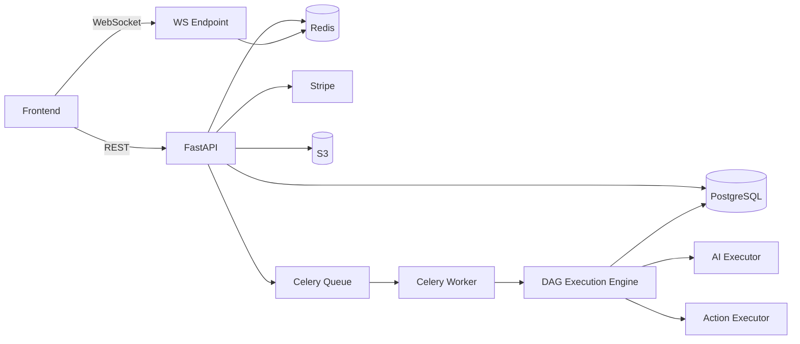
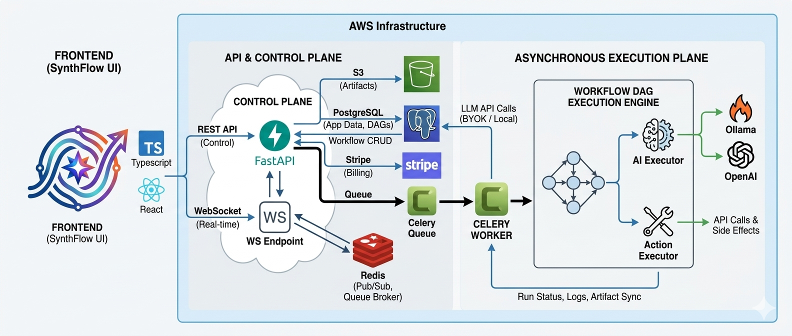

# Architecture

## Overview

SynthFlow is an AI-enabled workflow orchestration platform where each workflow is a Directed Acyclic Graph (DAG) of nodes.

Node categories:

- Trigger nodes: start execution (manual, webhook, scheduled)
- AI nodes: reasoning-heavy transformation using LLMs
- Action nodes: API calls and side effects

The platform focuses on reliability through asynchronous execution, structured node logs, retries, timeout policies, and artifact persistence.

## System Components

### Frontend (Next.js)

Responsibilities:

- Workflow builder UI (React Flow)
- Dashboard and run monitoring UI
- Billing and settings screens
- Authentication and token lifecycle handling

### Backend API (FastAPI)

Responsibilities:

- Auth and user management
- Workflow CRUD
- Triggering workflow execution
- Run status and node log retrieval
- Billing and usage endpoints
- Artifact retrieval endpoints
- Webhook ingestion
- WebSocket run updates

### Worker (Celery + Redis)

Responsibilities:

- Execute workflow DAGs asynchronously
- Resolve node dependencies and execution order
- Run node executors (trigger/AI/action)
- Apply retry/timeout behavior
- Persist run and node execution state

### Data and Integrations

- PostgreSQL: core metadata, workflows, runs, user/account records
- Redis: queue broker and pub/sub channel for real-time updates
- S3: large output artifact storage
- Stripe: billing plans and subscription lifecycle
- LLM providers: Ollama (local) and OpenAI (BYOK)

## Runtime Architecture Diagram

## Workflow Execution Model

1. A workflow run is requested (manual/webhook/schedule).
2. API validates request, usage limits and workflow ownership.
3. API creates run metadata and enqueues job.
4. Worker loads workflow definition and computes executable order from DAG edges.
5. Each node executes with upstream context available via template resolution.
6. Node outputs are persisted; large outputs may be externalized to S3 as artifacts.
7. Run-level status is streamed in real time through Redis pub/sub to WebSocket clients.
8. Run completes with final status and aggregate logs.

## Reliability Patterns

- Retry policies for transient failures
- Timeout configuration per node/executor category
- Dead run recovery via scheduled beat task
- Structured request and execution logging
- Health and readiness endpoints for operations
- Environment-based security checks (production secret validation)

## Security Model (High Level)

- JWT-based access control for private API routes
- User-level ownership checks for workflow and run resources
- CORS limited to configured frontend origin
- Encrypted storage for sensitive user API keys
- Rate limiting for public trigger surfaces (webhook endpoints)

## Architecture diagram

The above image shows a detailed architectural diagram showing used tech stacks with general data and execution flow.
