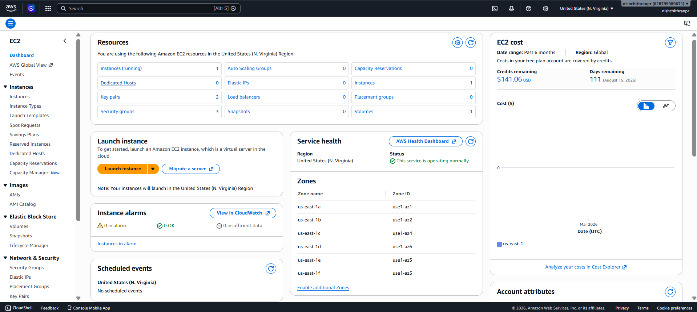
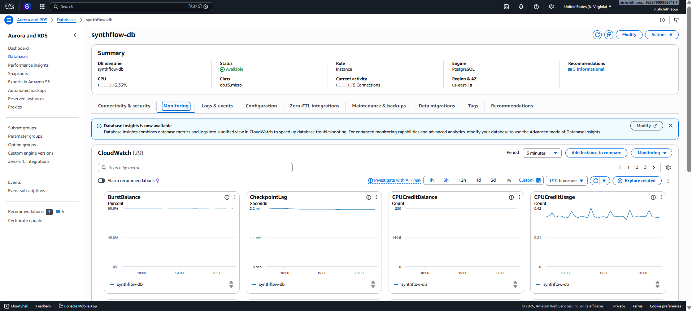
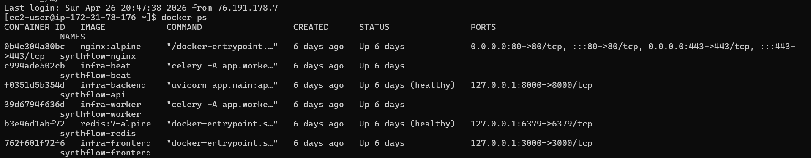
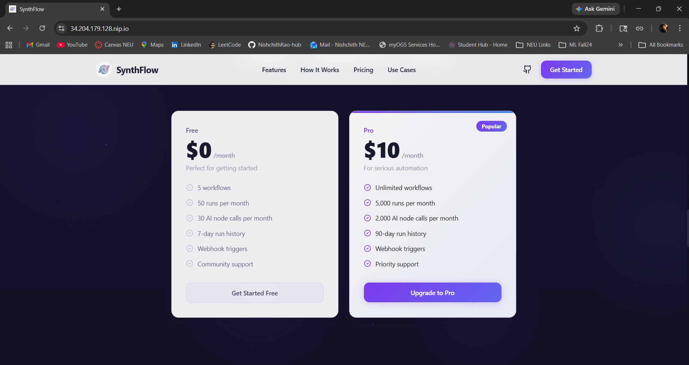

# Deployment Guide (EC2 + RDS + S3)

This guide follows the production topology in infra/docker-compose.prod.yml.

## Target Topology

- EC2: hosts frontend, backend, worker, beat, Redis, Nginx
- RDS PostgreSQL: managed primary database
- S3: artifact storage
- Stripe: billing events and subscription lifecycle

## 1) Provision Infrastructure

1. Create EC2 instance (t3.micro for free tier path)
2. Install Docker and Docker Compose plugin
3. Create RDS PostgreSQL instance
4. Create S3 bucket for artifacts
5. Create domain DNS record (or use EC2 IP)
6. Configure SSL certificates (Lets Encrypt)

## 2) Prepare Production Environment

From repo root:

```bash
cp infra/.env.production.example .env.production
```

Fill all required values in .env.production.

Minimum required areas:

- DATABASE_URL (RDS)
- REDIS_URL (redis service in compose)
- Google OAuth credentials
- JWT secret (strong random)
- Stripe keys + webhook secret
- AWS keys + S3 bucket
- FRONTEND*URL/BACKEND_URL and NEXT_PUBLIC*\* values

## 3) Configure SSH and Deploy Script

The deployment script supports Linux/macOS and common Windows path patterns (WSL/Git Bash).

Deploy command:

```bash
bash infra/deploy.sh <EC2_PUBLIC_IP>
```

Optional full checklist script:

```bash
bash infra/deploy-production-steps.sh <EC2_PUBLIC_IP>
```

What deploy.sh does:

1. SSH preflight checks
2. Syncs project files to EC2
3. Uploads .env.production
4. Renders Nginx SSL config from template
5. Rebuilds and starts containers
6. Waits for API health
7. Runs Alembic migrations
8. Prints service status

## 4) Post-Deploy Validation

Health:

```bash
curl -s https://your-domain/api/health
curl -s https://your-domain/api/health/ready
```

API docs:

- https://your-domain/docs
- https://your-domain/redoc

Frontend:

- https://your-domain/

## 5) Stripe Webhook Setup

Set Stripe webhook destination to:

- https://your-domain/api/billing/stripe-webhook

Use corresponding secret in STRIPE_WEBHOOK_SECRET.

## 6) Operational Runbook

### View container status

```bash
cd infra
docker compose -f docker-compose.prod.yml ps
```

### Stream logs

```bash
cd infra
docker compose -f docker-compose.prod.yml logs -f backend
docker compose -f docker-compose.prod.yml logs -f worker
docker compose -f docker-compose.prod.yml logs -f frontend
```

### Restart services

```bash
cd infra
docker compose -f docker-compose.prod.yml restart backend worker beat frontend nginx
```

### Re-run migrations

```bash
docker exec synthflow-api alembic upgrade head
```

## 7) Production Hardening Checklist

- DEBUG=false in production
- Strong JWT_SECRET_KEY
- CORS set only to frontend domain
- HTTPS only
- Restrictive security groups (EC2 and RDS)
- Secrets never committed
- Backups and retention policy validated
- Health checks integrated into monitoring

### EC2 dashboard



The image shows the live AWS EC2 instance and dashboard details.

### RDS Config dashboard



The above image shows the AWS RDS configuration and its details.

### Running containers



The image shows the running docker containers (worker, beat, backend and frontend) for production.

### Live Production App



The above image shows the landing homepage for Synthflow live in production environment.
